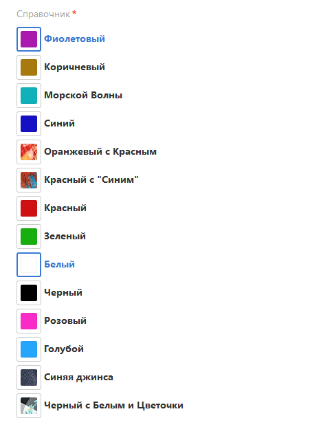

# api.formdesigner

## TS Умный конструктор форм на инфоблоках (api.formdesigner)
   Современная адаптивная форма с множеством функций сможет не только отправлять письма с сайта с вложением, но и сохранять все заявки в инфоблок.
   Современный, стильный дизайн.
   
   Тип свойства: Привязка к элементам **с группировкой по разделам**
   Поможет выводить элементы инфоблока с группировкой и изображение элемента при изменении списка.
   
   Тип свойства: **Привязка к платежным системам**
   Поможет выводить платежные системы интернет-магазина списком или переключателями.
   
   Встроенные маски помогут пользователю правильно заполнить поле.
   
   По умолчанию встроена скрытая защита от спама и роботов, можно смело отключать стандартную капчу.
   
   Умная кнопка отправки формы подскажет, что сейчас делает форма.
   
   Так хранятся заявки в инфоблоке, столбцы можно менять, можно выводить только самое нужно из полей формы.
   
   Так выглядит настройка свойств инфоблока в админке для показа полей в форме.
   
   Файлы загружаются с помощью Аякса, даже после обновления страницы или неудачной отправки формы они не потеряются.
   
   Встроена поддержка справочников.
   
   
   